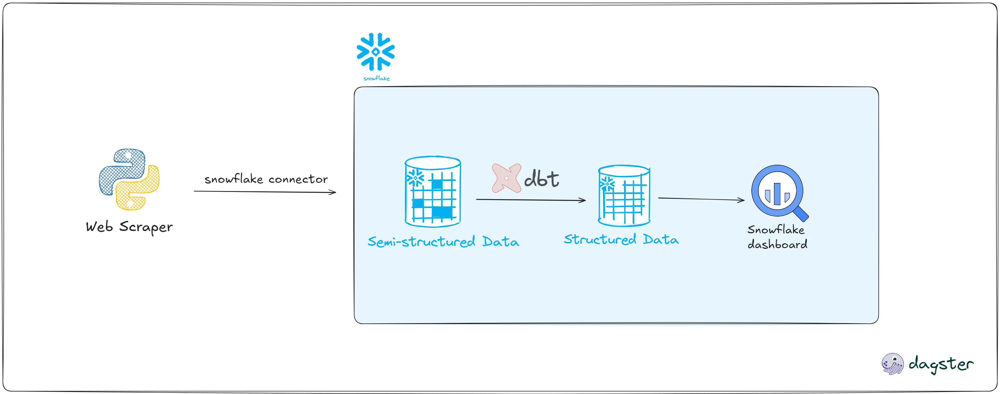
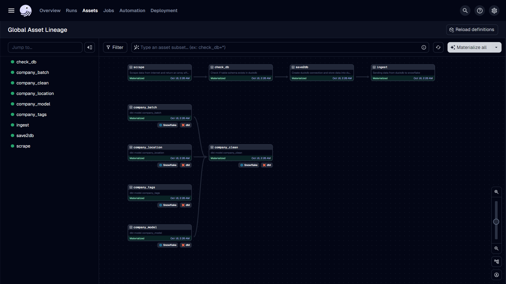

# Automated Company Scraper

This project automates the scraping, processing, and ingestion of company data from the Y Combinator website into a **data warehouse**. The scraped data is cleaned and processed using **DuckDB**, then loaded into **Snowflake**. Once the data is ingested, **dbt** (data build tool) performs **ELT (Extract, Load, Transform)** operations to transform the raw data into analytics-ready tables. The entire **data pipeline** is orchestrated using **Dagster**.

## Objective

Main objective of this project is to scrape data from Y combinator website periodically and ingest that data into snowflake for analytics.

## Architecture


## Workflow

1. **Scraping**: Company data (name, description, industry, etc.) is scraped from the Y Combinator website using libraries like selenium, beautifulsoup from python
2. **Cleaning & Staging**: The scraped data is cleaned and stored temporarily in DuckDB.
3. **Loading to Snowflake**: Clean data is ingested into Snowflake using snowflake connector.
4. **ELT with dbt**: dbt transforms raw data in Snowflake into well-structured tables ready for analysis.
5. **Orchestration**: Dagster manages and schedules the entire pipeline, ensuring that each step runs in the correct sequence.


## Result



## Tech Stack

- **Python**: For web scraping, data processing, and automation.
- **BeautifulSoup**: To extract company data from the Y Combinator website.
- **DuckDB**: A lightweight columnar database used for staging and cleaning data.
- **Snowflake**: Cloud-based data warehouse where data is ingested and stored.
- **dbt**: Used for transforming and modeling the data once it's in Snowflake.
- **Dagster**: Orchestrates the entire workflow from scraping to transformation.


## Installation

### Prerequisites

- Python 3.8+
- Snowflake account
- dbt
- Dagster
- DuckDB

### Setup

1. Clone the repository:

   ```bash
   git clone https://github.com/yourusername/automated-company-scraper.git
   cd automated-company-scraper
